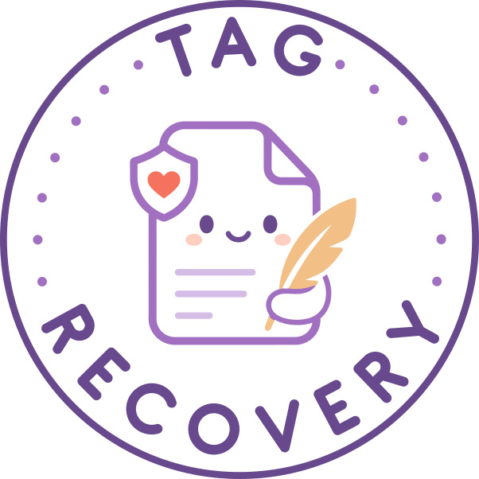
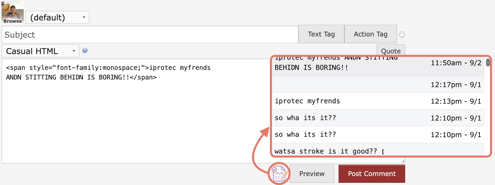
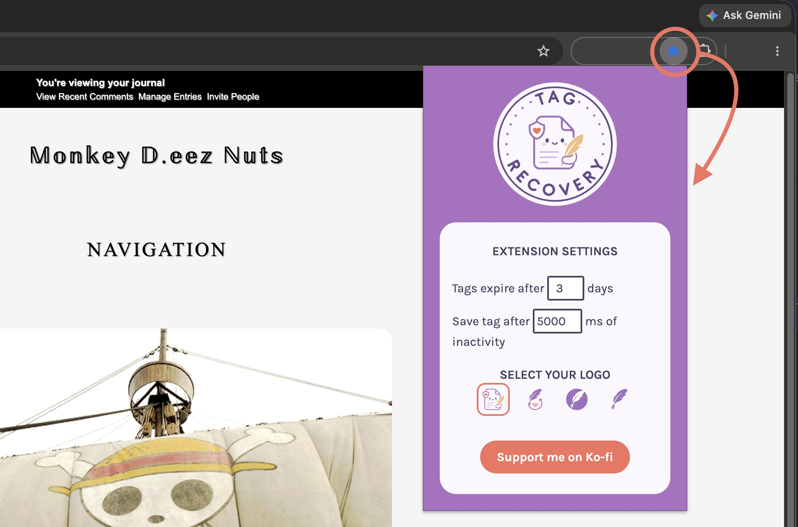
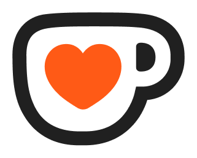

# Tag Recovery

<p align="center">
  
</p>

<p align="center">
  <strong>Your tag is safe, even when the browser isn't.</strong><br />
  A browser extension that quietly saves your in-progress Dreamwidth tags, so a crash, a closed tab, or a login switch never costs you a post.
</p>

<p align="center">
  <a href="https://addons.mozilla.org/en-US/firefox/addon/tag-recovery/">Install for Firefox</a>
  ·
  <a href="https://chromewebstore.google.com/detail/tag-recovery/pndobcmiekagakecokaakanabdifnhok">Install for Chrome</a>
</p>

## What it does

Roleplay on Dreamwidth means long, careful tags written across a lot of moving parts — different journals, different comms, different threads. Losing one to a crash is enough to put anyone off rewriting it.

- **Saves as you write** — Every entry and comment is captured in the background automatically.
- **Knows your games** — Each saved tag is filed away with its journal, community, and thread, so restoring the right one is obvious.
- **Cleans up** — After a handful of days, old tags are automatically deleted, so nothing piles up in your browser storage.
- **Customization** — Set storage expiration, choose your recovery icon, and pick how often tags are saved.

## In use

| View saved tags | Change your settings |
| --- | --- |
|  |  |
| On a Dreamwidth page, click the recovery icon under the comment box to see a list of tags saved for that community's thread. | Click the recovery icon in the extension toolbar to change your settings. |

## Support

Tag Recovery is free and always will be. If it's saved you some heartbreak, consider donating! A Ko-fi helps me keep it going.

<a href="https://ko-fi.com/Z8Z8DBS8S">
   Support on Ko-fi
</a>

## Development

This is a pnpm workspace built with Vite and the [`@crxjs/vite-plugin`](https://github.com/crxjs/chrome-extension-tools), targeting both Chrome and Firefox manifests.

```sh
pnpm install

# run a dev build for a single target
pnpm dev:chrome
pnpm dev:firefox

# build both targets
pnpm build
```

## Links

- [What's new / changelog](whats-new.html)
- [Report a bug](https://github.com/spitsfire/tag-recovery/issues)
- Logo designed by [@andrew_wiper](https://www.fiverr.com/andrew_wiper)
